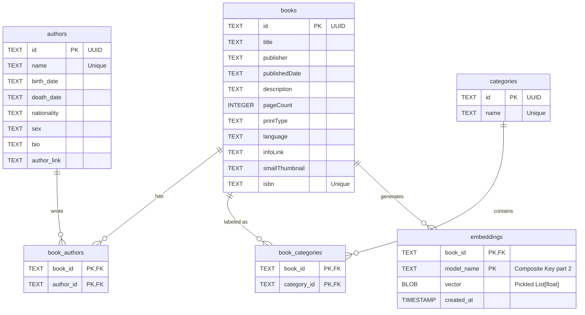

```mermaid
erDiagram
    %% Core Entity: The Book
    books {
        TEXT id PK "UUID"
        TEXT title
        TEXT publisher
        TEXT publishedDate
        TEXT description
        INTEGER pageCount
        TEXT printType
        TEXT language
        TEXT infoLink
        TEXT smallThumbnail
        TEXT isbn "Unique"
    }

    %% Entity: Authors
    authors {
        TEXT id PK "UUID"
        TEXT name "Unique"
        TEXT birth_date
        TEXT death_date
        TEXT nationality
        TEXT sex
        TEXT bio
        TEXT author_link
    }

    %% Entity: Categories
    categories {
        TEXT id PK "UUID"
        TEXT name "Unique"
    }

    %% Join Table: Many-to-Many relationship between Books and Authors
    book_authors {
        TEXT book_id PK, FK
        TEXT author_id PK, FK
    }

    %% Join Table: Many-to-Many relationship between Books and Categories
    book_categories {
        TEXT book_id PK, FK
        TEXT category_id PK, FK
    }

    %% Entity: Vector Embeddings (1-to-Many with Books)
    embeddings {
        TEXT book_id PK, FK
        TEXT model_name PK "Composite Key part 2"
        BLOB vector "Pickled List[float]"
        TIMESTAMP created_at
    }

    %% Relationships
    books ||--o{ book_authors : "has"
    authors ||--o{ book_authors : "wrote"
    
    books ||--o{ book_categories : "labeled as"
    categories ||--o{ book_categories : "contains"

    books ||--o{ embeddings : "generates"
```