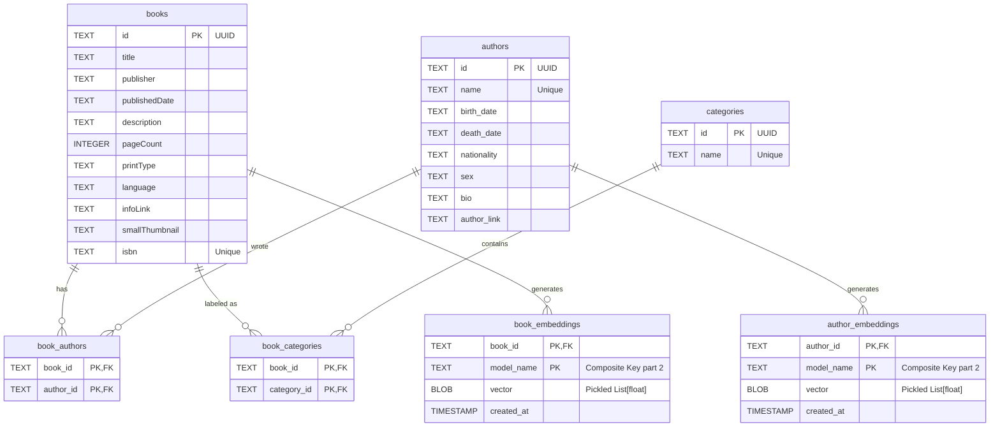

# Book Library

An AI-powered book database built with Python and SQLite. This project allows you to manage a collection of books with detailed information about authors, categories, and AI-generated embeddings for similarity searches.

## Features

- 📚 **Book Management**: Add books by ISBN using the Google Books API
- ✍️ **Author Profiles**: Automatically populate author details and biographical information
- 🏷️ **Categorization**: Organize books by categories
- 🤖 **Embeddings**: Generate and store vector embeddings for semantic search
- 📊 **Streamlit Dashboard**: Interactive visualization of your book library
- 🔗 **Google Sheets Integration**: Bulk import ISBNs from a Google Sheet

## Installation

### Prerequisites

- Python 3.8+
- SQLite3
- Google API credentials (for Google Sheets integration)

### Setup

1. **Clone and navigate to the project:**

   ```bash
   cd book_library
   ```

2. **Install dependencies:**

   ```bash
   pip install -r requirements.txt
   ```

   Or if using Poetry:

   ```bash
   poetry install
   ```

3. **Configure environment variables:**
   Create a `.env` file in the project root with your Google Sheets credentials:

   ```plain
   GOOGLE_SHEET_ID=your_sheet_id
   GOOGLE_SHEET_NAME=your_sheet_name
   ```

## Usage

### Command Line Interface

The `main.py` script provides several commands for managing your book library:

#### Add a single book by ISBN

```bash
python main.py --isbn 9780140136296
```

#### Import books from Google Sheet

```bash
python main.py --from-sheet
```

This reads ISBNs from the first column of your configured Google Sheet and adds all books to the database.

#### Populate author information

```bash
python main.py --fill-authors
```

Fetches biographical data for authors that are missing detailed information.

#### Generate embeddings

```bash
python main.py --fill-embeddings
```

Generates vector embeddings for book descriptions and author information using configured embedding models.

### Streamlit Dashboard

Launch the interactive dashboard to visualize and browse your library:

```bash
streamlit run streamlit_app.py
```

The dashboard includes:

- **Overview**: Summary statistics and top authors/categories
- **Books**: Search books, view language distribution, and explore embeddings via UMAP visualization
- **Authors**: Browse authors, view nationalities, and analyze author similarity
- **Categories**: Explore book categories and their distribution
- **Edit Database**: Direct database editing interface

## Database Schema

The project uses SQLite with the following main tables:



## Project Structure

```plain
book_library/
├── src/                          # Main source code
│   ├── agent/                   # AI agent functionality
│   ├── book_api/                # Google Books API integration
│   ├── database/                # Database handling (db.py)
│   ├── embeddings/              # Embedding generation
│   ├── logger/                  # Logging configuration
│   ├── models/                  # Data models and configurations
│   ├── streamlit_app/           # Streamlit dashboard components
│   ├── populate_authors.py      # Script to fill author information
│   ├── populate_books.py        # Script to add books to database
│   └── populate_embeddings.py   # Script to generate embeddings
├── data/                        # Data files and cached API responses
│   └── isbn_response/           # Cached Google Books API responses
├── tests/                       # Test suite
├── main.py                      # CLI entry point
├── streamlit_app.py             # Streamlit dashboard
├── pyproject.toml               # Project dependencies
└── README.md                    # This file
```

## Configuration

### Environment Variables

- `GOOGLE_SHEET_ID`: Your Google Sheet ID for bulk imports
- `GOOGLE_SHEET_NAME`: The sheet name containing ISBNs
- `DATABASE_PATH`: Optional custom database location

### Embedding Models

The project supports multiple embedding models. Configure the model name in the Streamlit app:

- `qwen3-embedding:0.6b` (default)
- Other Ollama-compatible models

## Key Components

### Database (`src/database/db.py`)

Main class for database operations:

- `add_book()`: Insert book with authors and categories
- `add_author()`: Insert/update author information
- `add_book_embedding()`: Store book embeddings
- `add_author_embedding()`: Store author embeddings
- `run_query()`: Execute custom SQL queries

### Populators

- **populate_books.py**: Fetches book data from Google Books API
- **populate_authors.py**: Enriches author information from external sources
- **populate_embeddings.py**: Generates and stores vector embeddings

## Development

### Running Tests

```bash
pytest tests/
```

### Code Style

The project uses:

- `ruff` for linting
- `pytest` for testing

Configure your editor to automatically format on save using the `ruff.toml` configuration.

## License

[Add your license here]

## Contributing

[Add contribution guidelines here]
